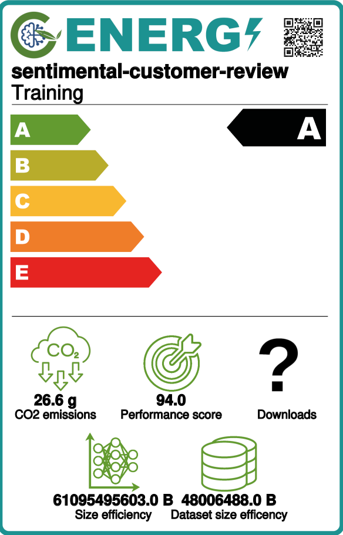
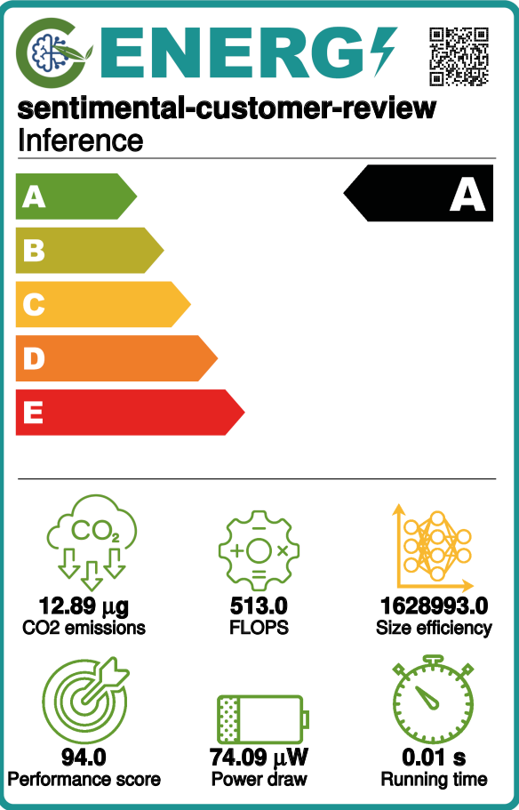

# TAED2_Amazon_Review_Classifiers

<a target="_blank" href="https://cookiecutter-data-science.drivendata.org/">
    
</a>

Sentiment Classification for Amazon reviews

## Project Organization

```
├── LICENSE            <- Open-source license if one is chosen
├── Makefile           <- Makefile with convenience commands like `make data` or `make train`
├── README.md          <- The top-level README for developers using this project.
├── data
│   ├── external       <- Data from third party sources.
│   └── raw            <- The original, immutable data dump.
│
├── docs               <- Holds our measured emission files as well as the GAISSA label files
│   ├── emissions      <- Holds measured emission files.
│   └── gaissa_labels  <- Holds the created Gaissa Labels.
│
├── models             <- Trained and serialized models, model predictions, or model summaries
│
├── notebooks          <- Jupyter notebooks. Naming convention is a number (for ordering),
│                         the creator's initials, and a short `-` delimited description, e.g.
│                         `1.0-jqp-initial-data-exploration`.
│
├── params.yaml	       <- Contains parameter values for tweaking the model as well as file paths
│                       
│
├── references         <- Data dictionaries, manuals, and all other explanatory materials.
│
├── reports            <- Generated analysis as HTML, PDF, LaTeX, etc.
│   └── figures        <- Generated graphics and figures to be used in reporting
│
├── requirements.txt   <- The requirements file for reproducing the analysis environment, e.g.
│                         generated with `pip freeze > requirements.txt`
│
├── setup.cfg          <- Configuration file for flake8
│
└── src   <- Source code for use in this project.
    │
    ├── __init__.py             <- Makes taed2_amazon_review_classifiers a Python module
    │
    ├── config.py               <- Store useful variables and configuration
    │
    ├── utilities.py            <- Holds common utility functions
    │
    ├── modeling                
    │   ├── __init__.py 
    │   ├── predict.py                       <- Code to run model inference with trained models          
    │   ├── evaluate.py                      <- Code to evaluate the performance of model against unseen data
    │   ├── check_data.py                    <- Code to check the data
    │   ├── train_test_split.py              <- Code to split a dataset into train and test data
    │   ├── train.py                         <- Code to train models
    │	├── tokenization_and_split.py        <- Code to split and tokenize the data
    │	├── embedding_matrix_generation.py   <- Code to generate the embedding matrix
    │	└── model_test.py                    <- Code to test the model
    │
    └── app
        ├── api.py              <- Code for FastAPI interface
        └── schema.py           <- Code for input validation using pydantic
    
```

## Energy Label

### Training




### Inference (100k Reviews)



## Setup Guide (Ubuntu)
1. Clone repository
```
git clone <repository-url>
```
2. Get correct Python version & Jupyter
```
sudo apt-get install python3.10
sudo apt-get install jupyter
```
3. Create virtual environment
```
pip install virtualenv
cd  <project root>
python3 -m venv venv
source venv/bin/activate
```
4. Install packages
```
pip install -r requirements.txt
```
5. Create custom kernel
```
pip install ipykernel
python -m ipykernel install --user --name=myenv --display-name "Python (myenv)"
```
6. Start Jupyter
```
jupyter notebook
```
7. Select created kernel in the drop down menu top left when you have openend ```TAED2_Amazon_Review_Classifiers/notebooks/1.0-mhs-original-hugging-face-notebook.ipynb```
